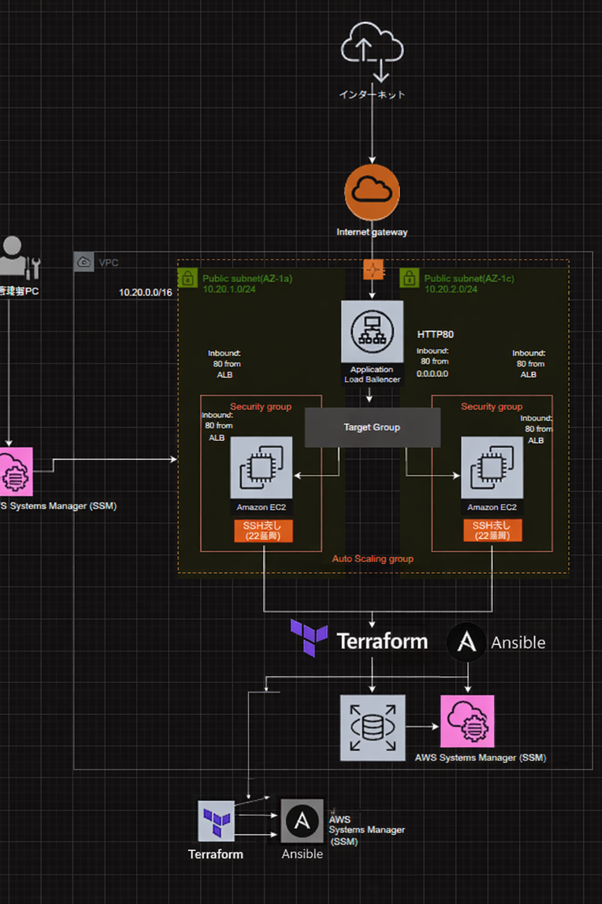

# AWS Infrastructure Portfolio  
Terraform × ALB × Auto Scaling × SSM (SSHレス運用)

TerraformおよびAnsibleを利用したAWSインフラ構築のポートフォリオです。  
Infrastructure as Codeを用いたインフラ自動化の検証環境として作成しました。

---

# インフラ構成



---

# 構成概要

Terraformを使用してAWS環境を構築し、  
AnsibleおよびAWS Systems Managerを利用してサーバ構成管理を行っています。

SSH接続を使用せず、SSMを利用してEC2へコマンド実行を行う構成です。

ALBおよびAuto Scaling Groupを使用し、Webサーバの冗長構成を構築しています。

---

# 使用技術

- AWS
- Terraform
- Ansible
- AWS Systems Manager
- Application Load Balancer
- Auto Scaling
- Amazon Linux
- Nginx

---

# ディレクトリ構成

````
aws-portfolio/
├── terraform
│ ├── modules
│ └── envs
│ └── dev
├── ansible
│ ├── inventory
│ └── playbooks
└── README.md
````

---

# Terraform 実行手順

terraform init
terraform plan
terraform apply


---

# Ansible 実行手順

ansible-playbook ssm_web.yml -vv


---

# 構築内容

Terraformにより以下のAWSリソースを構築します。

- VPC
- Subnet
- Security Group
- EC2
- ALB
- Auto Scaling Group

AnsibleおよびAWS Systems Managerを利用して以下の設定を自動化しています。

- nginxインストール
- Webページ配置
- サービス起動

---

# 学習目的

このポートフォリオでは以下のスキル習得を目的としています。

- TerraformによるInfrastructure as Code
- Ansibleによる構成管理
- AWS Systems Managerを利用したサーバ管理
- SSH接続を使用しないインフラ管理
