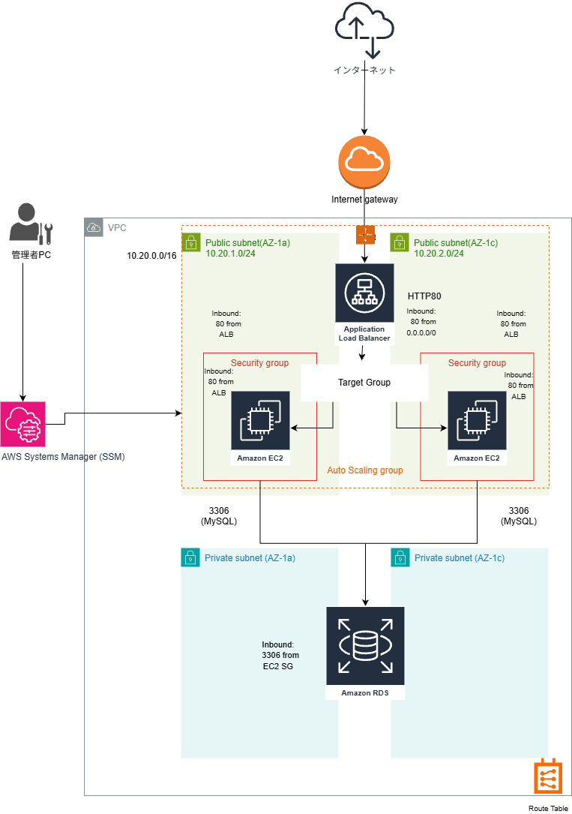

# Terraform ポートフォリオ - Phase4
## ALB + AutoScaling + RDS(Private) + SSM構成

## 概要
Terraformを用いて、高可用なWeb3層構成を構築しました。
Web層はALB + Auto Scaling Groupで冗長化し、
DB層はPrivate SubnetにRDS(MySQL)を配置しています。
EC2への運用アクセスはSSHではなくSSM(Session Manager)を利用しています。

---

## 構成概要

### ■ ネットワーク
- VPC：10.20.0.0/16
- Public Subnet（Web層）
  - AZ-a：10.20.1.0/24
  - AZ-c：10.20.2.0/24
- Private Subnet（DB層）
  - AZ-a：10.20.11.0/24
  - AZ-c：10.20.12.0/24
- Internet Gateway + Public Route設定

### ■ Web層
- Application Load Balancer（HTTP:80）
- Target Group（ヘルスチェック設定）
- Auto Scaling Group（EC2 2台）
- user_dataでApache自動インストール

### ■ DB層
- RDS MySQL
- Private Subnetに配置
- publicly_accessible = false
- EC2のSecurity Groupからのみ3306許可

### ■ 運用設計
- EC2へはSSM Session Managerで接続
- IAM RoleにAmazonSSMManagedInstanceCore付与
- SSHポート(22)は不要な設計

---

## セキュリティ設計
- ALB：80を全世界から許可
- EC2：80はALB SGからのみ許可
- RDS：3306はEC2 SGからのみ許可
- SG参照方式で最小権限構成を実装

---

## 実行手順

terraform init
terraform validate
terraform plan
terraform apply
terraform destroy

## 学習ポイント
- Public/Private Subnet分離設計
- ALB + ASGによる高可用構成
- SG参照による安全なDBアクセス制御
- SSMを用いた鍵不要の運用設計
- TerraformによるIaC管理
